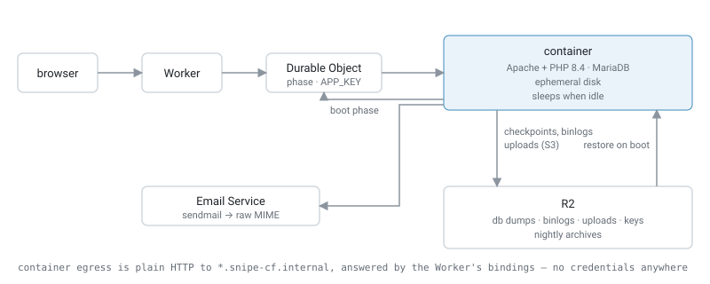

# Snipe-IT on Cloudflare

[Snipe-IT](https://github.com/grokability/snipe-it) running entirely on Cloudflare: one container, one R2 bucket, no other services.

[](https://deploy.workers.cloudflare.com/?url=https://github.com/AlecDusheck/snipe-it-cloudflare)

Click, pick a name, open the URL. Snipe-IT's setup wizard does the rest. Requires the Workers Paid plan.

Snipe-IT itself is upstream's release, unmodified, installed the way upstream's `upgrade.php` does it. This repo is a simple Cloudflare Durable Object/Container around a normal Snipe-IT instance.

## When to use this
Use this if you want Snipe-IT to exist without being a machine you own. No OS to patch, no docker-compose.yml to remember, no backup cron you've never tested a restore from. It fits well if:

- You're already on Cloudflare, or already tunneling Snipe-IT through it.
- You want SSO in front of it without standing anything up. Cloudflare Access is one policy away.
- Cost sensitive (cold start can be enabled or disabled)  
- You want zero-configuration backups which are easy to restore from
- Zero patching and auto updates

This was really made to be something where you can click the "deploy with Cloudflare" button, you set it up, and forget about it.

## Motivation
Lots of people already run Snipe-IT behind a Cloudflare Tunnel. At that point the only thing still on your own hardware is a box that needs patching, a MySQL you hope is being backed up, and a docker-compose.yml you last touched a year ago. This moves that part to Cloudflare too.

Asset tracking turns out to be a good fit. You touch it a few times a week, so it can sleep; the data is small and boring, so R2 handles it; and the thing you actually care about is that it's still there in three years — which is a storage problem, not a compute problem.

## Configuration

Every string in `wrangler.jsonc` `vars`, and every secret from `wrangler secret put`, is passed to Snipe-IT as-is — use the names from [`.env.example`](https://github.com/grokability/snipe-it/blob/master/.env.example). Database and filesystem settings are fixed.

Email goes through [Cloudflare Email Service](https://developers.cloudflare.com/email-service/) by default: onboard your domain once with `npx wrangler email sending enable example.com`, then set `MAIL_FROM_ADDR` in `wrangler.jsonc`. To use another provider instead, set `MAIL_MAILER=smtp` and the usual `MAIL_HOST` / `MAIL_PORT` / `MAIL_USERNAME` vars, with `MAIL_PASSWORD` as a secret.

`APP_URL` is taken from the first request; set it explicitly in `vars` once you add a custom domain.

Crons are UTC and Snipe-IT's scheduled tasks fire at 00:00 `APP_TIMEZONE`; shift the crons if you change the timezone.

## Backups

Under `snipeit/` in the bucket: `db/dump/` (newest `KEEP_CHECKPOINTS`), `db/binlog/`, `db/archive/YYYY-MM-DD.sql.gz` (nightly, `KEEP_ARCHIVE_DAYS`), `files/`, `keys/`. To roll back, stop the container and point `db/LATEST` at a dump:

```sh
npx wrangler r2 object get --remote snipeit-state/snipeit/db/archive/2026-09-01.sql.gz --file a.sql.gz
npx wrangler r2 object put --remote snipeit-state/snipeit/db/dump/1.sql.gz --file a.sql.gz
printf 1 | npx wrangler r2 object put --remote snipeit-state/snipeit/db/LATEST --pipe
```

`db/archive/` holds plain `mysqldump` output, gzipped. Nothing here is a proprietary format — download a day's archive and you can restore it into any MySQL, on a VPS or anywhere else, without this project involved.

## How it works



- **Database** lives on the container's disk. Binary logs ship to R2 every 30 s and a full dump every 30 min, both only when something changed, plus a dump on shutdown. **Every boot restores from R2**. Ungraceful host death is tested with SIGKILL.
- **Uploads** go straight to R2
- **Credentials** don't exist. The container reaches R2, the DO and Email Service through virtual hosts handled by the Worker; `APP_KEY` and the DB password are generated on first boot and kept in DO storage.
- **Sleep** after `SLEEP_AFTER` (1h) of idle. The next visitor sees a wake screen for ~5-10 s; API clients just wait. `"0"` keeps it running at standard [Cloudflare Containers pricing](https://developers.cloudflare.com/containers/pricing/). Cloudflare Containers are very competitivly priced.
- **Updates** happen at boot: the newest release on `SNIPEIT_TRACK` (`v8`) is installed from GitHub the way upstream's `upgrade.php` does it. A running container restarts nightly if a release is waiting. For production, pin an exact version (`SNIPEIT_TRACK: "v8.7.2"`) and bump it deliberately — Snipe-IT point releases occasionally ship manual upgrade notes.
- **Email** goes out through Email Service via Snipe-IT's `sendmail` transport; the Worker hands the raw message to the binding.

## Development

```sh
npm install
npm run check   # types, tsc, oxlint, oxfmt
npm run deploy  # needs Docker
```
